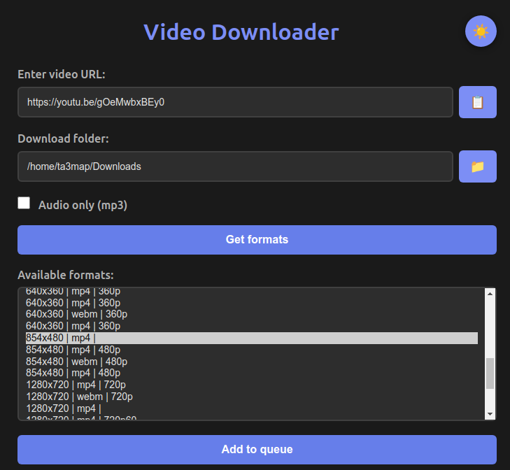
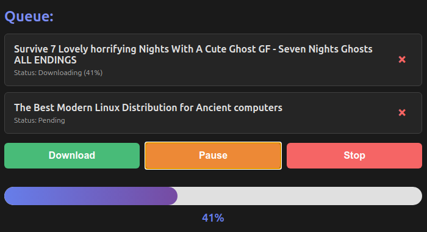
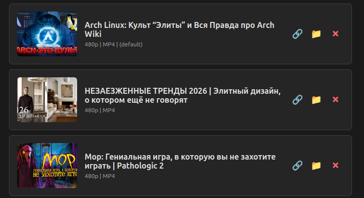

# Video Downloader

A simple desktop application for downloading videos from various platforms using yt-dlp.

## [Download](https://github.com/ta3map/DownloadVideo/releases)

## Usage

1. Enter video URL
2. Select download folder
3. Choose format or enable audio-only mode
4. Add to queue
5. Start download

## Screenshots

<p align="center">
  <strong>Main Interface</strong><br>
  <br><br>
  <strong>Queue Management</strong><br>
  <br><br>
  <strong>Download History</strong><br>
  
</p>


## Run from the sourcecode

1. Clone the repository
2. Install dependencies:
```bash
pip install -r requirements.txt
```

3. Run the application:
```bash
python app.py
```


## License

This project is licensed under the MIT License - see the [LICENSE](LICENSE) file for details.

